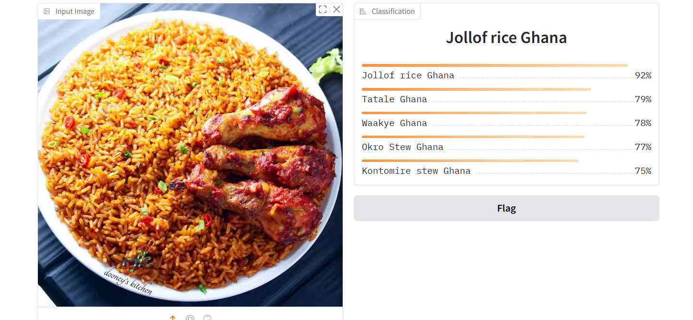

# 🍽️ Ghanaian Food Image Classifier

This project implements a deep learning model that classifies images of **Ghanaian food** using computer vision. The model is trained in the `food_vision.ipynb` notebook and leverages transfer learning with a powerful pretrained CNN backbone.


## 📚 Project Overview

- 🇬🇭 Focus: Classifying popular Ghanaian dishes from images (banku, Kenkey, etc)
- 🧠 Model: **ConvNeXt** (by Facebook AI)
- 📁 Framework: Built using PyTorch
- 🏷️ Classes: Multiple Ghanaian food categories (e.g., jollof, waakye, kenkey, banku, fufu, etc.)
- 🎯 Goal: Build an image classifier to support food recognition apps, health tracking tools, or cultural promotion platforms


## 🗂️ Dataset

Images source: https://huggingface.co/datasets/devkyle/ghanaian-food-dataset?library=datasets 


## 🧠 Model Architecture

- Backbone: `ConvNeXt` (e.g., ConvNeXt-Tiny or ConvNeXt-Small)
- Input size: Images resized to 224×224
- Output: Softmax layer with **N** units (N = number of food classes)
- Loss: `CrossEntropyLoss`
- Optimizer: `AdamW` with learning rate scheduler

### ⚡ Why ConvNeXt?
- Combines transformer-style improvements with CNN efficiency
- Scales well with more data
- Delivers **state-of-the-art accuracy** on image classification tasks


## 🛠️ How to Run

### 1. Clone the repo
```bash
git clone https://github.com/yourusername/ghanaian-food-classifier.git
cd ghanaian-food-vision
```


### 2. Launch the notebook
```bash
jupyter notebook food_vision.ipynb
```


## 🚀 Features

- ✅ Accurate Ghanaian food classification
- ✅ Uses transfer learning for improved accuracy with limited data
- ✅ Data augmentation to improve generalization
- ✅ Training, validation, and test evaluation
- ✅ Option to export trained model


## 📊 Evaluation

Here’s how the model performed after 15 epochs of training:

-Accuracy: 83.75%
-Precision: 88.93%
-Recall: 83.75%
-F1 Score: 83.87%

Although the model isn’t perfect (about 83% accuracy overall), it performs well in predicting the majority of food items accurately and quickly! This is a significant improvement from my original model, and I plan to keep refining it to improve these metrics further.


## 📦 Potential Applications

- 🍱 Nutrition tracking apps
- 📱 Mobile food recognition tools
- 🌍 Promoting Ghanaian culture and cuisine
- 📊 Restaurant menu auto-tagging
- 🔬 Food AI research in underrepresented cuisines


## 🤝 Acknowledgments

- Dataset curated from publicly available images and original sources
- Inspired by [Food-101](https://data.vision.ee.ethz.ch/cvl/datasets_extra/food-101/) and adapted for Ghanaian cuisine


## 📌 Future Work

- Deploy the model using Streamlit or Flask
- Extend to multilabel classification (e.g., combo meals)
- Add calorie/nutrition estimates based on predicted class

# 🍽️ Ghanaian Food Image Classifier

 
 - linkedIn article explaining the processes thoroughly: https://www.linkedin.com/pulse/ghanaian-food-vision-model-kenneth-kwame-dotse-rdwyf/?trackingId=RhxDebxDSNeU9Qyd%2BfzX7w%3D%3D 

 - huggingface space: https://huggingface.co/spaces/Kennethdot/Food_vision 🤗
